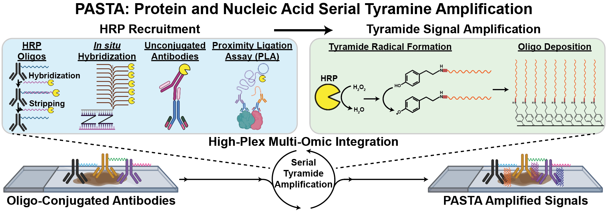

# PASTA: Versatile Tyramide-oligonucleotide Amplification for Multi-modal Spatial Biology

## Abstract

Spatial proteomics techniques have revolutionized our understanding of tissue architecture, but are frequently limited by detection sensitivity, bioconjugation limitations, multiplexing capacity, and multi-modal integration. A critical gap remains between high-plex spatial discovery platforms and clinically deployable biomarker assays. Here we present Protein and nucleic Acid Serial Tyramide Amplification (PASTA), a novel signal amplification approach that significantly enhances detection sensitivity while maintaining compatibility with diverse spatial profiling methodologies. PASTA utilizes horseradish peroxidase (HRP) recruitment pathways to generate tyramide radicals that deposit oligonucleotides, enabling adaptable signal amplification across multiple biomarkers at high-plex via cyclical imaging using complementary fluorophore-labeled oligonucleotides. We demonstrate that PASTA achieves extensive signal enhancement for markers with minimal background in blank controls. The method is compatible with *in situ* hybridization for DNA/RNA detection, proximity ligation assays for protein-protein interactions, sequential antibody staining protocols, or any modular combination thereof. This enables post-hoc rescue of markers with suboptimal signal-to-noise ratios, integration of conjugation-resistant antibodies, and extended multiplexing of commercial RNA *in situ* hybridization  with simultaneous protein co-detection from precious clinical samples without requiring additional tissue sections or costly reagents. PASTA is compatible with FFPE clinical samples and works with established commercial platforms and off-the-shelf reagents, requiring no specialized equipment. As we progress towards high-plex spatial multi-omics discovery efforts, PASTA is well situated as a cost-effective bridge from discovery to clinically deployable spatial multi-omics biomarker validation.

## Copyright & Licence

The PASTA code and data are released to the academic community for non-commercial academic research only. **Any commercial research use, integration into commercial products or services requires prior approvals.**

## Figures

### Scripts for Figures
An overview of the purpose of different scripts to reproduce the figures in the manuscript.

| File Name                              | Description                                             |
|----------------------------------------|---------------------------------------------------------|
| `paper_figures/PASTA_Fig1_Quantification.Rmd`                 | Code for plots in Figure 1 and corresponding Supplemental Figures S1-3    |
| `paper_figures/PASTA_Fig3_Quantification.Rmd`                 | Code for plots in Figure 3 and corresponding Supplemental Figures S5-8    |
| `paper_figures/PASTA_Fig3_PhenotypeMaps.ipynb`                | Code for phenotype maps in Figure 3C and corresponding Supplemental Figures S6 and S8C |

### Data Availability

The code is designed to work with the data available on [Zenodo](https://doi.org/10.5281/zenodo.18525925). The "data" folder in Fig1_data.zip contains all necessary data to generate the quantification plots in Fig. 1 and S1-3 using the above code. The "data" folder in Fig3_data.zip contains all necessary data to generate the quantification plots and phenotype maps in Fig. 3 and S5-8 using the above code.

## Script for OT-2 automation

We are providing interested users with templates of the python scripts for PASTA automation on the OT-2 liquid handling platform.

| File Name                              | Description                                             |
|----------------------------------------|---------------------------------------------------------|
| `automation/PASTA_oligoHRP_automation.py`                | Flexible automation script for up to 4 samples and up to 32 cycles    |

## Contributors
- Hendrik A. Michel
- Wenrui Wu
- Huaying Qiu
- Sizun Jiang

## Contact

For inquiries regarding this repository, please contact Sizun Jiang ([sjiang3@bidmc.harvard.edu](sjiang3@bidmc.harvard.edu)) and Hendrik Michel ([hmichel@bidmc.harvard.edu](hmichel@bidmc.harvard.edu)).

## Citation

To cite this work, please cite:
Michel et al. (2025), "PASTA: Versatile Tyramide-oligonucleotide Amplification for Multi-modal Spatial Biology", bioRxiv, 2025.04.30.651463; doi: 10.1101/2025.04.30.651463
