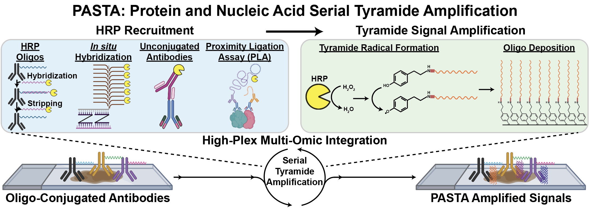

# PASTA: Versatile Tyramide-oligonucleotide Amplification for Multi-modal Spatial Biology

## Abstract

Spatial proteomics is limited by detection sensitivity, multiplexing, and multi-modal integration, leaving a gap between discovery and clinical assays. Here we present Protein and nucleic Acid Serial Tyramide Amplification (PASTA), employing horseradish peroxidase-mediated oligonucleotide deposition and cyclical imaging for high-plex, multi-modal spatial profiling. Compatible with conjugated antibodies and *in situ* hybridization, PASTA enables simultaneous protein and RNA co-detection from FFPE samples, providing a cost-effective bridge from discovery to clinical validation.

## Copyright & Licence

The PASTA code and data are released to the academic community for non-commercial academic research only. **Any commercial research use, integration into commercial products or services requires prior approvals.**

## Figures

### Scripts for Figures
An overview of the purpose of different scripts to reproduce the figures in the manuscript.

| File Name                              | Description                                             |
|----------------------------------------|---------------------------------------------------------|
| `paper_figures/PASTA_Fig1_Quantification.Rmd`                 | Code for plots in Figure 1 and corresponding Extended Data Figures 1-5    |
| `paper_figures/PASTA_Fig2_Quantification.Rmd`                 | Code for plots in Figure 2 and corresponding Extended Data Figures 6-10    |
| `paper_figures/PASTA_Fig2_PhenotypeMaps.ipynb`                | Code for phenotype maps in Figure 2C and corresponding Extended Data Figure 7, 10B and Supplementary Figures 1-2 |

### Data Availability

The code is designed to work with the data available on [Zenodo](https://doi.org/10.5281/zenodo.18525925). The "data" folder in Fig1_data.zip contains all necessary data to generate the quantification plots in Fig. 1 and Extended Data Fig. 1-5 using the above code. The "data" folder in Fig2_data.zip contains all necessary data to generate the quantification plots and phenotype maps in Fig. 2, Extended Data Fig. 7, and Supplementary Fig. 1-2 using the above code.

## Script for OT-2 automation

We are providing interested users with templates of the python scripts for PASTA automation on the OT-2 liquid handling platform. A thorough documentation can be found [here](automation/)

| File Name                              | Description                                             |
|----------------------------------------|---------------------------------------------------------|
| `automation/PASTA_oligoHRP_automation.py`                | Flexible automation script for up to 4 samples and up to 32 cycles    |

## Contributors
- Hendrik A. Michel
- Wenrui Wu
- Huaying Qiu
- Sizun Jiang

## Contact

For inquiries regarding this repository, please contact Sizun Jiang ([sjiang3@bidmc.harvard.edu](sjiang3@bidmc.harvard.edu)) and Hendrik Michel ([hmichel@bidmc.harvard.edu](hmichel@bidmc.harvard.edu)).

## Citation

To cite this work, please cite:
Michel et al. (2025), "PASTA: Versatile Tyramide-oligonucleotide Amplification for Multi-modal Spatial Biology", bioRxiv, 2025.04.30.651463; doi: 10.1101/2025.04.30.651463
