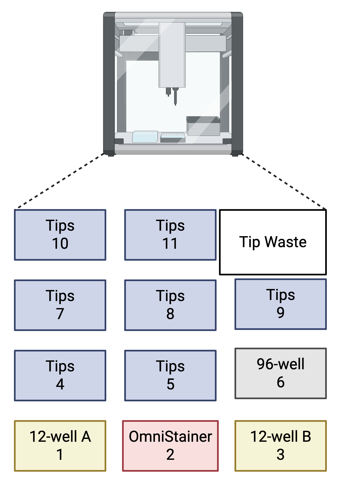
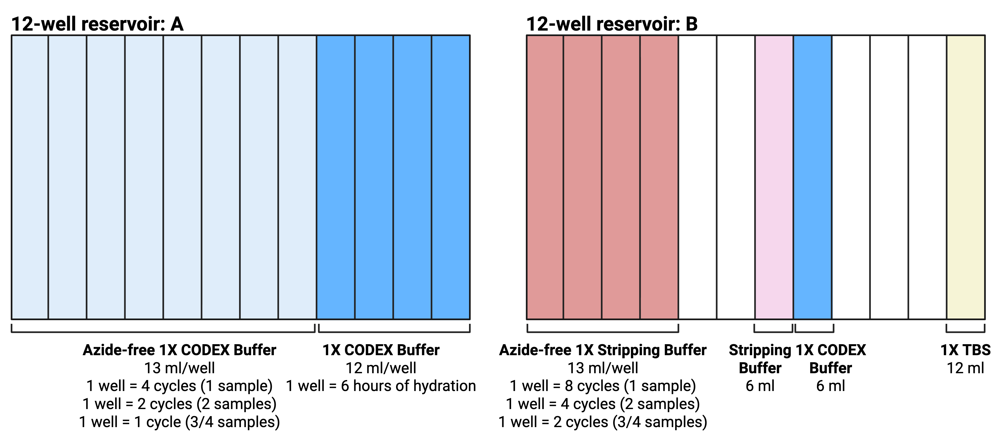
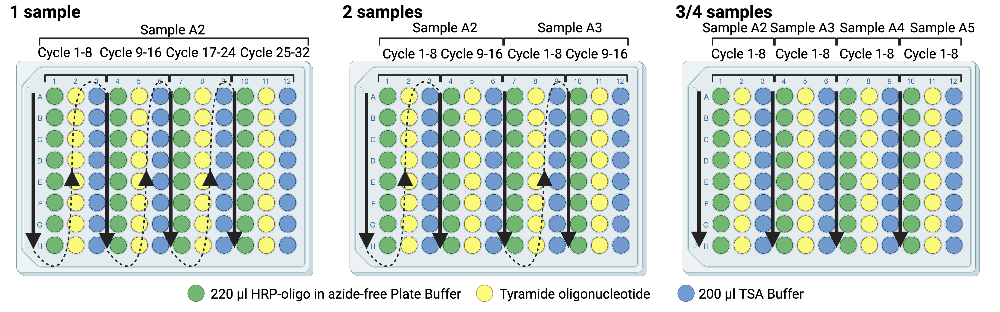

# PASTA oligo-HRP automation using the OT-2

This documentation explains application and considerations of the automated PASTA oligo-HRP script.

## Table of Contents
- [Files](#files)
- [Software Setup](#software-setup)
- [OT-2 setup](#ot-2-setup)
- [Experimental Considerations](#experimental-considerations)

## Files 

The below python script is a flexible script allowing PASTA oligo-HRP for the following combinations on slides or coverslips

| Samples     | Maximum Number of Cycles  |
|-------------|---------------------------|
|    1        |  32   |
|    2        |  16   |
|    3        |  8   |
|    4        |  8   |


| File Name                              | Description                                             |
|----------------------------------------|---------------------------------------------------------|
| `automation/PASTA_oligoHRP_automation.py`                | Flexible automation script for up to 4 samples and up to 32 cycles    |


## Software setup

The included python script contains a setup function at the beginning with a few key setup features:

```python
#################### MODIFIABLE RUN PARAMETERS #########################
```

The ***par2_type*** variable determines what model of OmniStainer was used. Users should comment out the unused version.

```python
# !!! IMPORTANT !!! Leave only the appropriate lines below uncommented
par2_type= 'omni_stainer_c12_cslps' # Use this for Parhelia OmniStainer for coverslips
par2_type= 'omni_stainer_s12_slides' # Use this for Parhelia OmniStainer for slides
```

The ***wellslist*** variable determines how many samples are being used and where they are located. Hewere we have set up the samples to be placed in the top row of the OmniStainer, left-to-right. Users should comment out the unused versions. Also note the warning about maximal number of cycles depending on the number of samples used.

```python
# !!! IMPORTANT !!! Leave only the appropriate lines below uncommented
wellslist = ['A2'] # 1 sample - max 32 cycles
wellslist = ['A2', 'A3']  # 2 samples - max 16 cycles
wellslist = ['A2', 'A3', 'A4'] # 3 samples - max 8 cycles
wellslist = ['A2', 'A3', 'A4', 'A5'] # 4 samples - max 8 cycles
```

The ***PASTA_cycles*** variable determines how many cycles of the PASTA oligo-HRP amplifications are supposed to take place. Each cycle is linked to its own wells for HRP oligos and tyramide oligos for each sample (see below). Again, the user is reminded of the maximum number of cycles being limited by the number of samples being used.

```python
PASTA_cycles = 12 # Specify the number of cycles where each cycle amplifies one marker at a time
```

The ***Tyr_dilution_lib*** represents a library of the tyramide oligonucleotide dilution for each sample for each cycle. This allows the user maximal freedom in choosin a custom dilution. The value for each combination of cycle and sample should be the dilution factor, that is the *fraction from the tyramide oligonucleotide stock needed to achieve the target concentration*. For example, a dilution to 5 µM from a 250 µM stock represents a 1:50 dilution. Users should ignore the dilution factor for all combinations of cycle and sample that are not being used as the function will only call used combinations. For a 2 sample run with 2 samples, this would mean:
- Cycle 1: 1:50 dilution for sample 1, 1:100 dilution for sample 2
- Cycle 2: 1:10 dilution for sample 1, 1:25 dilution for sample 2

```python
Tyr_dilution_lib = {# Specify the dilution factor of your PASTA oligos for each cycle for each sample. 
                    # 50 = 1:50 dilution such as 5 µM staining with 250 µM stock solution.
    # Cycles 1-8: Valid for all configurations (1, 2, 3, or 4 samples)
    1:  {'A2': 50, 'A3': 100, 'A4': 50, 'A5': 50},
    2:  {'A2': 10, 'A3': 25, 'A4': 50, 'A5': 50},
    3:  {'A2': 50, 'A3': 50, 'A4': 50, 'A5': 50},
    4:  {'A2': 50, 'A3': 50, 'A4': 50, 'A5': 50},
    5:  {'A2': 50, 'A3': 50, 'A4': 50, 'A5': 50},
    6:  {'A2': 50, 'A3': 50, 'A4': 50, 'A5': 50},
    7:  {'A2': 50, 'A3': 50, 'A4': 50, 'A5': 50},
    8:  {'A2': 50, 'A3': 50, 'A4': 50, 'A5': 50},
    
    # Cycles 9-16: Valid for 1 or 2 sample configurations only
    9:  {'A2': 50, 'A3': 50},
    10: {'A2': 50, 'A3': 50},
    11: {'A2': 50, 'A3': 50},
    12: {'A2': 50, 'A3': 50},
    13: {'A2': 50, 'A3': 50},
    14: {'A2': 50, 'A3': 50},
    15: {'A2': 50, 'A3': 50},
    16: {'A2': 50, 'A3': 50},
    
    # Cycles 17-32: Valid for 1 sample configuration only
    17: {'A2': 50},
    18: {'A2': 50},
    19: {'A2': 50},
    20: {'A2': 50},
    21: {'A2': 50},
    22: {'A2': 50},
    23: {'A2': 50},
    24: {'A2': 50},
    25: {'A2': 50},
    26: {'A2': 50},
    27: {'A2': 50},
    28: {'A2': 50},
    29: {'A2': 50},
    30: {'A2': 50},
    31: {'A2': 50},
    32: {'A2': 50},
}
```

To prevent the tissue from dying out at the end of the protocol should the user not be able to collect the samples immediately, an automatic hydration protocol is included. The variable ***hydration_time*** represents the time of hydration **in hours** during which the sample will get rinse with a small amount of 1X CODEX buffer every 15 minutes. Users should not exceed 24 hours of hydration.

```python
hydration_time = 6 # Specify how long (in hours) the OT-2 should hydrate the tissue after final PASTA incubation. Do not exceed 24 hours.

```

We have included a recommended default deck layout below. Should users wish to change the layout, they should do so here. Similarly, should users wish to use a different position for the pipette (default is "right"), they should update the code below.

```python
#################### LABWARE LAYOUT ON DECK #########################
pipette_300_location='right'
pipette_300_GEN = 'GEN2'

labwarePositions = Object()
labwarePositions.buffers_reservoir_1 = 1
labwarePositions.buffers_reservoir_2 = 3
labwarePositions.reagent_plate = 6
labwarePositions.par2 = 2
labwarePositions.tiprack_300_1 = 4
labwarePositions.tiprack_300_2 = 5
labwarePositions.tiprack_300_3 = 7
labwarePositions.tiprack_300_4 = 8
labwarePositions.tiprack_300_5 = 9
labwarePositions.tiprack_300_6 = 10
labwarePositions.tiprack_300_7 = 11
```


## OT-2 setup
### Deck layout


*Figure generated with Biorender.com*

The 96-well plate in slot 2 is placed on top of the Opentrons OT-2 temperature module. To prevent the tip from getting stuck on the foil, we recommend taping the 96-well plate to the temperature module.


### 12-well layout


*Figure generated with Biorender.com*

The script expects the above reagents in each well of the 12-well reservoir plates. For reagents with multiple wells per reagents (CODEX buffer or stripping buffer), the script expects the indicated volume in the indicated number of wells, filled left-to-right.

We recommend the 12-well 15ml reservoirs by Stellar Scientific (cat# CT229562) sealed with adhesive foil (cat# AB0626, ThermoFisher.


### 96-well plate layout


*Figure generated with Biorender.com*

The script expects the following reagents in each group of 3 wells per cycle per sample (left-to-right):
- 220 µl HRP-oligo in azide-free Plate Buffer at 200 nM
- Tyramide oligo on its own diluted relative to 200 µl (e.g. 4 µl if doing a 1:50 dilution)
- 200 µl TSA Buffer

We recommend the 96-well plate by Sigma (cat# BR781607-100EA) sealed with adhesive foil (cat# AB0626, ThermoFisher.


### OmniStainer
For this protocol, the samples are placed in the top row of the OmniStainer from left to right. The protocol is optimized for coverslips with the non-adhesive microfluidic coverslip holders and for slides with the non-adhesive microfluidic slide covers.

## Experimental considerations

### Limits
We have carried out PASTA runs on the OT-2 of 2 samples up to 12 cycles or 3 samples up to 8 cycles. The code we provide here represents a general template which has not been tested at its extremes.

### Volume overflow
During the extremes of this experiment (4 samples, 8 cycles, 24 hours hydration) about 200 ml of waste liquid will be generated in the OmniStainer. In our experience, 100 ml of waste are tolerated without any difficulties. Therefore, should the experiment exceed more than half the maximum number of cycles for any number of samples, we recommend pausing the protocol before reaching that cycle to empty the liquid waste and tip waste.


